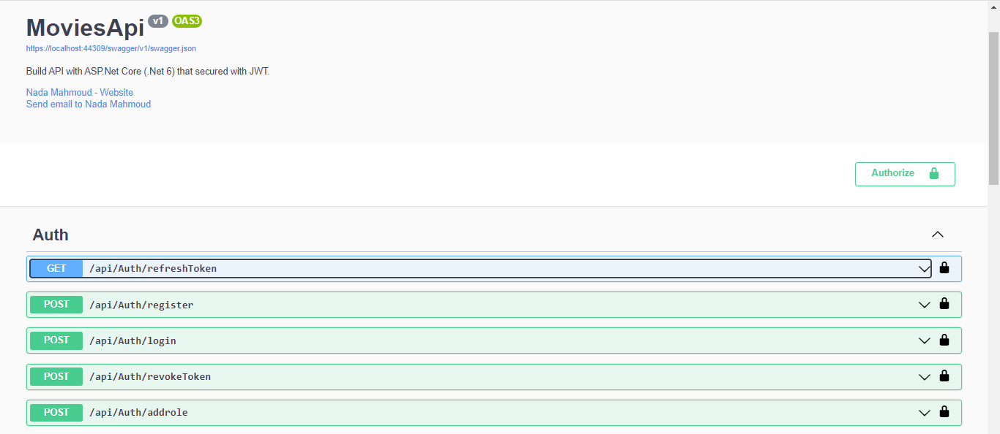
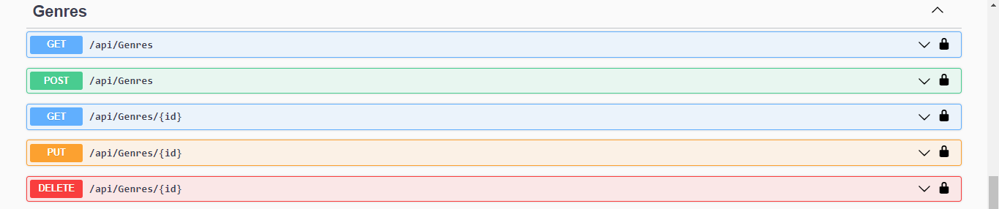
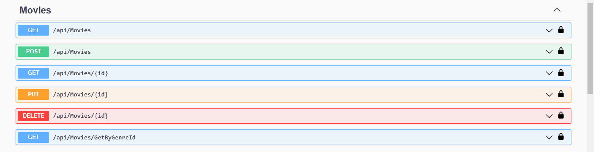
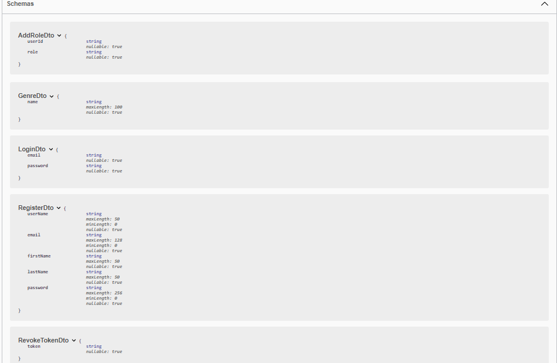

# Movies API
### Build ASP.NET Core Web API (.NET 6) :
1. Following [Clean Architecture](https://docs.microsoft.com/en-us/dotnet/architecture/modern-web-apps-azure/common-web-application-architectures#clean-architecture).
2. Use Entity Framework Core and LINQ.
3. Use Asp.net Identity.
4. Implement the Repository and Unit of Work Patterns.
5. Secure API with JWT Authentication.
6. Implement Refresh Token (storing in cookie).
7. Apply Automapping and Extension Methods.
# Swagger UI Screenshots
- ### Auth Endpoints

- ### Genres Endpoints

- ### Movies Endpoints

- ### Schemas

- In (GET) revokeToken endpoint, token can passed throw Request body (RevokeTokenDto) or in cookie
- In (POST) Movie endpoint, data will be passed from form (to upload movie poster(supported)/ trailer video (feature can be [added](https://github.com/nadamhmudd/Movies-API/blob/master/Movies.Core/Interfaces/FileHandler/IFileHandler.cs) and [extended](https://github.com/nadamhmudd/Movies-API/blob/master/Movies.Services/Helpers/FileHandler/Base/BaseHandler.cs))
